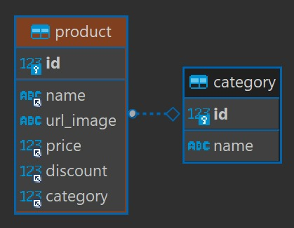

# BSALE - Backend &middot; [](https://www.npmjs.com/package/npm)

> Información acerca de la API desarrollada para la prueba de BSALE

Esta API permite obtener productos desde una base de datos relacional. Los productos se pueden filtrar por su nombre o por su categoría.

## Desarrollo

### Tecnologías

Para poder desarrollar esta API se han utlizado las siguientes tecnologías:

- Express (v4.18.2)
- Sequelize (v6.25.1)
- Dotenv (v16.0.3)
- Cors (v2.8.5)
- mysql2 (v2.3.3)
- nodemon (v2.0.20)

### Correr la API en local

```shell
# Clona el repositorio
git clone https://github.com/ashel1806/bsale-backend

# Accede a la carpeta del repositorio
cd bsale-backend

# Instala las dependencias necesarias
yarn install
# o npm install
```

Para poder iniciar la API se necesita crear y configurar un archivo `.env` con las variables de entorno que se encuentran en el archivo de ejemplo `.env.example`

```shell
DB_NAME # El nombre de la base de datos a utlizar
DB_USER # El usuario configurado para la conexión
DB_PASSWORD # La contraseña establecida para el usuario
DB_HOST # El host en donde se encuentra la base de datos
```

A continuación podremos iniciar el proyecto

```shell
yarn run dev
# o npm run dev
```

## Base de datos

La base de datos utilizada es MySQL. El esquema de relaciones utilizado es el siguiente:



## Enpoints

### Productos

```http
GET /api/products
```

##### Response

La respuesta es un objeto que contiene la siguiente información:

```json
{
  "totalItems": 57,
  "products": [
    {
      "name": "ENERGETICA MR BIG",
      "url_image": "https://dojiw2m9tvv09.cloudfront.net/11132/product/misterbig3308256.jpg",
      "price": 1490,
      "discount": 20,
      "type": {
        "name": "bebida energetica"
      }
    },
    {
      "name": "ENERGETICA RED BULL",
      "url_image": "https://dojiw2m9tvv09.cloudfront.net/11132/product/redbull8381.jpg",
      "price": 1490,
      "discount": 0,
      "type": {
        "name": "bebida energetica"
      }
    },
    ...
  ],
  "totalPages": 6,
  "currentPage": 0
}
```

- `totalItems` - Cantidad total de items devueltos por la API
- `products` - Array de todos los productos devueltos
  - Cada producto tiene el siguiente formato:
    ```javascript
    {
      "name": string
      "url_image": string
      "price": number
      "discount": number
      "type": {
        "name": string // Nombre de la categoria a la que pertenece
      }
    }
    ```
- `totalPages` - Cantidad de páginas totales
- `currentPage` - Página actual en la que se encuentran los datos

#### Filtros

###### Búsqueda por nombre

```http
GET /api/products?search=ron
```

##### Response

```json
{
  "totalItems": 13,
  "products": [
    {
      "name": "RON BACARDI AÑEJO",
      "url_image": "https://dojiw2m9tvv09.cloudfront.net/11132/product/bacardi9450.jpg",
      "price": 4990,
      "discount": 0,
      "type": {
        "name": "ron"
      }
    },
    {
      "name": "RON BACARDI 8 AÑOS",
      "url_image": "https://dojiw2m9tvv09.cloudfront.net/11132/product/bacardianejo9463.jpg",
      "price": 5990,
      "discount": 0,
      "type": {
        "name": "ron"
      }
    },
    ...
  ],
  "totalPages": 2,
  "currentPage": 0
}
```

###### Búsqueda por categoria

```http
GET /api/products?category=snack
```

##### Response

```json
{
  "totalItems": 5,
  "products": [
    {
      "name": "Maní salado",
      "url_image": "https://dojiw2m9tvv09.cloudfront.net/11132/product/manisaladomp4415.jpg",
      "price": 600,
      "discount": 0,
      "type": {
        "name": "snack"
      }
    },
    {
      "name": "Mani Sin Sal",
      "url_image": "https://dojiw2m9tvv09.cloudfront.net/11132/product/manisinsalmp6988.jpg",
      "price": 500,
      "discount": 0,
      "type": {
        "name": "snack"
      }
    },
    ...
  ],
  "totalPages": 1,
  "currentPage": 0
}
```

###### Búsqueda por nombre y categoría

```http
GET /api/products?search=pampero&category=ron
```

##### Response

```json
{
  "totalItems": 2,
  "products": [
    {
      "name": "RON PAMPERO",
      "url_image": "https://dojiw2m9tvv09.cloudfront.net/11132/product/pampero-especial0296.jpg",
      "price": 5490,
      "discount": 20,
      "type": {
        "name": "ron"
      }
    },
    {
      "name": "RON PAMPERO ANIVERSARIO",
      "url_image": "https://dojiw2m9tvv09.cloudfront.net/11132/product/ron_pampero_aniversario0311.jpg",
      "price": 20000,
      "discount": 15,
      "type": {
        "name": "ron"
      }
    }
  ],
  "totalPages": 1,
  "currentPage": 0
}
```

###### Filtrado por cantidad de items

```http
GET /api/products?limit=2
```

##### Response

```json
{
  "totalItems": 57,
  "products": [
    {
      "name": "ENERGETICA MR BIG",
      "url_image": "https://dojiw2m9tvv09.cloudfront.net/11132/product/misterbig3308256.jpg",
      "price": 1490,
      "discount": 20,
      "type": {
        "name": "bebida energetica"
      }
    },
    {
      "name": "ENERGETICA RED BULL",
      "url_image": "https://dojiw2m9tvv09.cloudfront.net/11132/product/redbull8381.jpg",
      "price": 1490,
      "discount": 0,
      "type": {
        "name": "bebida energetica"
      }
    }
  ],
  "totalPages": 29,
  "currentPage": 0
}
```

###### Combinacion de los filtros

```http
GET /api/products?search=pampero&category=ron&limit=1
```

##### Response

```json
{
  "totalItems": 2,
  "products": [
    {
      "name": "RON PAMPERO",
      "url_image": "https://dojiw2m9tvv09.cloudfront.net/11132/product/pampero-especial0296.jpg",
      "price": 5490,
      "discount": 20,
      "type": {
        "name": "ron"
      }
    }
  ],
  "totalPages": 2,
  "currentPage": 0
}
```
